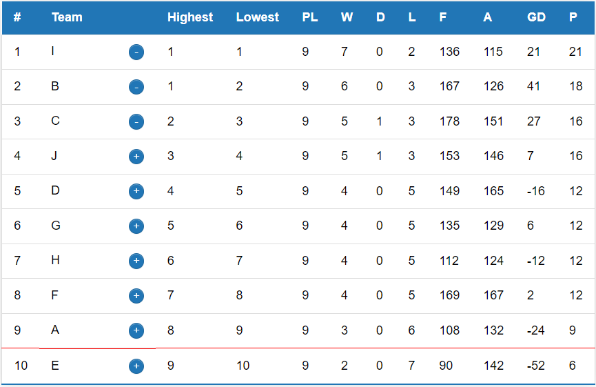
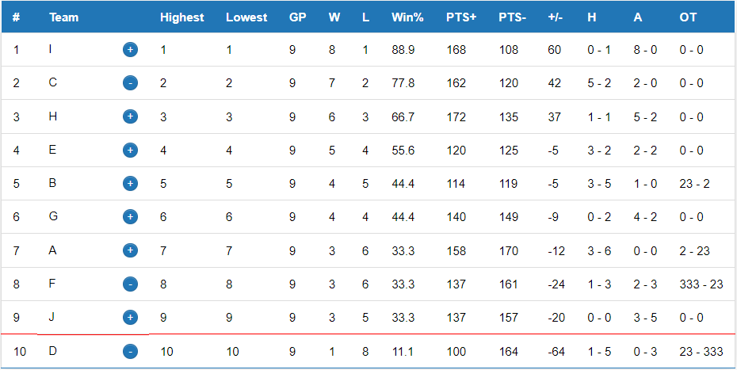
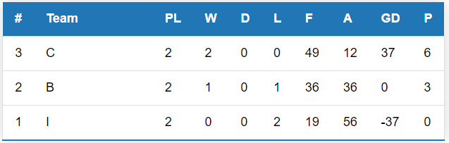
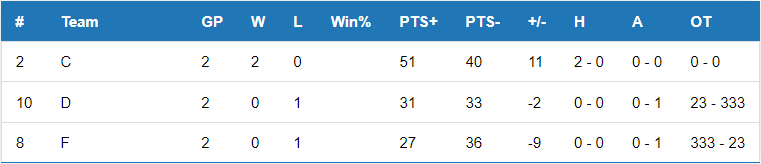

# Sports Tournament Page

This web application allows users to create and manage sports tournaments using JavaScript, HTML, and CSS. Users can generate regular games and playoff games. 
Data is stored in local storage. [Live demo](https://deimantedav.github.io/Sports-tournament-platform/)🚀

## Features
- **Sport Selection**: basketball or football.
- **Extensive settings for regular season and playoffs games**: comprehensive options for regular season and playoff games, including the number of rounds and teams involved.

### Regular Season Games

- **Create Regular Games**: Users can create regular season games between specified teams.
- **Leaderboard** 🏆: The leaderboard can be displayed in a modern or traditional format.

- **Compare Teams**: A separate table allows users to compare chosen teams.

- **Relegations**: Users can manage relegations within the regular games feature.

-**Position Calculations**: The system calculates the possible highest and lowest positions for teams, guaranteeing wins or losses.
-**Generate Scores**: For better testing experience

### Playoffs
- **Configure Playoff Settings**: Configure playoff settings, including the number of participating teams and the format (single knockout or double elimination).
- **Display Playoff Games**: Playoff games are displayed in a separate playoffs table.

### Other Features

- **Data Storage**: All data is stored locally using local storage for easy access and retrieval.

## In Progress 🛠️

The following features are currently in progress or planned for future implementation:

- **Sport Selection**: Users will be able to choose between basketball or football games. This will affect scoring and sorting mechanisms.